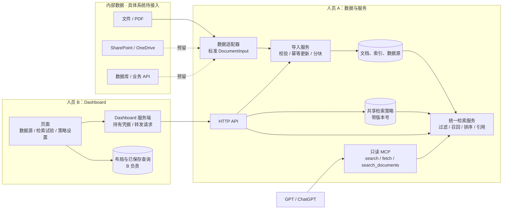

# 内部数据 → 检索服务 → MCP / Dashboard：架构与协作约定 v1

本文件是人员 A、B 的共同边界。范围以用户的内部数据需求为准；截图仅作为背景。
先固定数据结构与调用关系，再并行开发。本地 PDF 数据已接入。ChatGPT 账号连接按用户要求后置；Dashboard 由 B 实现。

## 1. 整体架构



**只有一套检索逻辑。** HTTP 与 MCP 都调用 `Hub`；Dashboard 不重写评分算法。
GPT 在对话里决定何时调用工具；MCP 本身不调用模型、不生成答案。

## 2. 责任划分

| 模块 | A：你 | B：合作者 |
|---|---|---|
| 数据接入 | 获取原始数据，适配统一字段，维护同步游标与失败重试 | 展示数据源与文档数量 |
| 入库和索引 | 校验、更新、分块、索引、显式删除 | 可选导入操作界面 |
| 检索和引用 | 过滤、评分、页码/原文位置、结果去重 | 搜索框、筛选器、结果及分项展示 |
| 检索策略 | 持久化、版本冲突检查、下一次查询生效 | 编辑权重、时间偏好、默认条数 |
| MCP | 工具契约、传输、接入验证 | 无需实现 MCP 客户端 |
| 自定义 Dashboard | 提供业务数据接口 | 组件布局、显隐、已保存查询与视图持久化 |
| 访问控制 | HTTP 读/管理权限；生产版再接企业身份体系 | 服务端保管密钥，映射页面操作权限 |

共享检索策略是工作区级；Dashboard 布局是视图级。移动卡片、保存查询不能隐式改变 GPT 的检索策略。

## 3. 一套数据模型

字段和约束以 `src/research_agent/hub_models.py` 为源，生成 `docs/contracts/openapi.json`。
不得在 A/B 两边各自维护不一致的字段名。

| 对象 | 关键字段 | 语义 |
|---|---|---|
| SourceDefinition | `id`, `name`, `kind`, `enabled` | `id` 稳定；`kind` 仅分类，不代表相应连接器已实现 |
| DocumentInput | `external_id`, `title`, `body`, `published_at`, `url`, `metadata`, `pages` | 适配器输出、导入接口输入 |
| 文档 ID | `id` | 服务生成；由 `source_id + external_id` 确定，内容更新后不变 |
| SearchRequest | `query`, `source_ids`, `since`, `until`, `metadata`, `limit` | HTTP 与 MCP 高级搜索共用 |
| SearchHit | `id`, `title`, `url`, `source_id`, `published_at`, `snippet`, `citation`, `score`, `score_details` | 每份文档只返回最高分片段 |
| 文档读取结果 | `id`, `title`, `text`, `url`, `metadata` | `body` 是导入字段；`text` 是对外读取字段，匹配 MCP |
| RetrievalPolicy | `source_weights`, `recency_boost`, `half_life_days`, `default_limit` | 全局检索偏好 |
| PolicyState | `version`, `policy`, `updated_at` | 修改时必须带原版本号 |

统一约定：

- JSON 使用 `snake_case`；未知字段拒绝，避免拼错配置后静默无效。
- `source_id` 使用 1–80 位英文字母、数字、下划线或连字符。
- `external_id` 必须是来源系统稳定主键。不要使用导入时间或正文作为主键。
- 同一来源、同一外部 ID 重复提交不新增文档；正文或元数据变化则更新并替换索引。
- 不同来源的相同正文保留各自记录，因为来源权重、出处和权限可能不同。
- 时间是带时区的 ISO 8601，服务统一转 UTC；未知发布时间为 `""`，不以导入时间冒充。
- `since` 包含边界，`until` 不含边界；日期筛选会排除发布时间未知的文档。
- `metadata` 为字符串键值；筛选使用精确相等，多个条件取 AND。
- `pages` 是 `[页码, 起始位置, 结束位置]`，页码从 1 开始；位置为 Unicode 码点，左闭右开。
- `citation` 的位置相对完整原文；JavaScript 如要按位置截取，使用 `Array.from(text).slice(start,end)`，不能直接假定 UTF-16 下标相同。
- 原始正文是不可信数据。文档内命令不会成为系统指令或执行动作。
- 没有原文 URL 时使用后端文档地址；该地址需鉴权，localhost 地址仅适用于本地开发，不宣称已能从 ChatGPT 打开引用。

## 4. 统一接口目录

API 契约版本为 `1.2.0`，当前地址前缀固定为 `/api`。未来破坏性变更使用新路径 `/api/v2`。
完整请求/响应字段、类型和认证声明见 OpenAPI；示例见 `contracts/examples.json`。

| HTTP 方法及路径 | 权限 | 请求模型 | 响应模型 |
|---|---|---|---|
| `GET /healthz` | 无 | 无 | 服务状态、API 版本 |
| `GET /api/status` | 读 | 无 | StatusResponse |
| `GET /api/retrieval` | 读 | 无 | RetrievalStatus：本地语义索引覆盖率 |
| `GET /api/sync` | 读 | 无 | SyncStatus：最近一轮同步、状态计数 |
| `GET /api/sync/files` | 读 | state / limit / offset | SyncFilesResponse：分页文件状态、重试次数和原因码 |
| `GET /api/sources` | 读 | 无 | SourcesResponse |
| `POST /api/sources` | 管理 | SourceDefinition | SourceDefinition；按 ID 创建或更新，完整替换配置 |
| `POST /api/ingest/documents` | 管理 | IngestRequest | IngestResponse：新增/更新/未变数量和文档 ID |
| `POST /api/search` | 读 | SearchRequest | SearchResponse |
| `GET /api/documents/{document_id}` | 读 | 路径 ID | MCPFetchResult |
| `DELETE /api/documents/{document_id}` | 管理 | 路径 ID | DeleteResponse |
| `GET /api/policy` | 读 | 无 | PolicyState |
| `PUT /api/policy` | 管理 | PolicyUpdate | PolicyState |

成功响应直接返回业务对象。HTTP 错误统一：

```json
{"error":{"code":"policy_version_conflict","message":"policy_version_conflict","fields":[]}}
```

`message` 暂与错误码相同，B 可根据 `code` 显示中文提示。`fields` 标明校验失败路径，不回显内部正文。

| 状态码 | 常见错误码 | B 的处理 |
|---|---|---|
| 401 | unauthorized | 提示检查登录/凭据 |
| 403 | admin_token_required | 隐藏或禁用管理操作 |
| 404 | document_not_found / source_not_found | 提示已删除、已禁用或来源未建立 |
| 409 | policy_version_conflict | 重新读取配置，让用户核对后再保存，不能自动覆盖 |
| 413 | request_too_large | 减小批次 |
| 422 | validation_error / unknown_source / query_too_complex | 展示字段错误或请求问题 |
| 503 | storage_unavailable | 提示数据服务暂不可用，检查存储后再重试 |

首版导入为同步批量 upsert，单批最多 100 份、正文合计 200 万字符、HTTP 请求最多 1200 万字节。
文件导入通过本地适配器；HTTP 不开放任意文件系统路径读取。
本地文件同步配置由管理员在本机提供，支持定期轮询、哈希检查点、重试及读取状态接口。
它是文件级完成进度，不是 PDF 解析过程的百分比；不提供远程配置任意目录的接口。
单份文档正文上限 100 万字符，完整 fetch 可能超过模型上下文，后续可新增分页读取工具，不能悄悄截断 `fetch`。

## 5. MCP 与 HTTP 的映射

| MCP 工具 | 输入 | 输出 | 底层调用 |
|---|---|---|---|
| `search` | `{query}` | `{results:[{id,title,url}]}` | 同一个检索服务，使用已保存策略 |
| `fetch` | `{id}` | `{id,title,text,url,metadata}` | 同一个文档读取服务 |
| `search_documents` | `{request: SearchRequest}` | SearchResponse | 与 `POST /api/search` 完全相同 |

三种工具都只读，无导入、删除或修改策略工具。SDK 负责 MCP 协议，工具返回结构化结果及兼容 JSON 文本。
MCP 工具错误使用 SDK 的 MCP 错误格式，不套 HTTP 的错误包裹。

标准 `search/fetch` 形状按 [OpenAI 官方 MCP 文档](https://developers.openai.com/api/docs/mcp) 实现。
传输支持本地 stdio 和 `/mcp` Streamable HTTP。远程 ChatGPT 连接仍需配置可达性和认证；可评估
[Secure MCP Tunnel](https://developers.openai.com/api/docs/guides/secure-mcp-tunnels)。当前未连接真实 ChatGPT 账号。

## 6. 检索和策略生效规则

采用 SQLite FTS5 + 有界中英术语扩展，可选本机 E5 int8 ONNX 混合检索，也支持 Ollama BGE-M3。
查询先去掉常见问句词，再将已知同义词编成 OR 组，概念之间仍取 AND；未识别词保留约束。
不把文档内容作为查询指令。语义候选与关键词结果执行相同来源/时间/metadata 筛选；
仅语义召回的片段需达到对应模型阈值（E5 为 0.84，BGE-M3 为 0.5），已识别公司名和明确日期还需匹配标题。
阈值是本地工程默认值，不代表答案正确的概率。

```text
关键词模式相关性 = max(0, -BM25)
混合模式相关性 = 0.4 × 本次查询归一化BM25 + 0.6 × max(0, cosine)
仅语义候选的关键词分为0；仅关键词候选的语义分为0
新鲜度 = 0.5 ^ (文档年龄天数 / half_life_days)
最终分 = 相关性 × 来源权重 × (1 + recency_boost × 新鲜度)
```

- 发布时间未知：新鲜度为 0，不获得时间加成。未来时间按年龄 0 处理。
- 来源权重范围 0–10，未指定时为 1；0 排除搜索结果，但不撤销已知文档 ID 的读取权限。
- `enabled=false` 同时关闭该来源的搜索和读取。它是工作区配置，不是用户级权限模型。
- 先执行来源/日期/元数据过滤，再评分所有匹配片段，再按文档取最佳片段、选前 K 项。
- `score` 仅用于同一次查询内的排序，不是置信度或概率；不同查询不能直接比较。
- `retrieval` 标明 bilingual/hybrid/bilingual_fallback 和回退原因；模型不可用时仍可关键词检索。
- `total` 是去重后的匹配文档数；`matched_chunks` 是过滤后、零权重排除前的匹配片段数。
- 配置保存提交后，下一次 HTTP/MCP 查询使用新版本。查询读到的配置与数据使用同一数据库快照。
- B 先 GET 策略，再 PUT `{expected_version, policy}`。版本冲突返回 409，避免两人相互覆盖。
- 查询请求中的过滤条件只影响该次查询；只有 PUT policy 会改变共享策略。

## 7. 内部数据接入预留点

支持两条路径，归一化后的数据结构相同：

1. **推送**：内部系统调用 `POST /api/ingest/documents`，提交标准文档。
2. **拉取适配器**：实现 `DataAdapter.iter_documents() -> Iterable[DocumentInput]`，交给 `sync_adapter`。

适配器负责数据系统的凭据、增量游标、删除标记、分页和重试；核心服务不绑定 SharePoint 或数据库厂商。
首版已提供 LocalFilesAdapter；SharePoint / 数据库 / API 的实际连接逻辑留待确定数据接口。
手动 `ingest` 重跑会检查文档内容，未变则跳过索引更新。
新增 `sync-once` / `watch` / `serve --sync-config` 在解析前核对原文件 SHA-256，
把检查点和重试状态存入独立 `sync.sqlite3`，进程重启后继续。
受支持文件默认等待 30 秒稳定，每轮完成后间隔 60 秒；失败指数退避、最多 5 次，
内容变化自动恢复或显式 `--retry-failed` 重试。语义模型已配置时自动补齐向量，失败下一轮重试。
文件监听适用于本机可读取的已展开文件；压缩包、未完成下载和扫描型 PDF 仍需相应预处理。
文件消失不会自动删文档，删除需要明确调用删除接口。
多记录 JSON 的本地外部 ID 使用文件名 + 数组位置，顺序变化会改变记录对应关系；真实业务应使用推送接口或自定义适配器提供稳定业务 ID。

## 8. 状态、限制与后续扩展

当前已实现可运行的本地后端和接口契约，测试覆盖导入更新、回滚、引用位置、过滤、策略生效、鉴权及 MCP 工具。
自动化测试覆盖 HTTP 与 MCP 工具、检索、策略和错误处理；在 `backend/tests/` 可本地重跑。
这不等于真实数据质量或远程 ChatGPT 端到端验收。

首版是单工作区、同步导入、本地 SQLite；HTTP 启动仅监听 loopback，读与管理 Token 分离。
Dashboard 开发时可以显式允许本地前端 Origin；生产版由 B 的服务端保管密钥，避免把管理 Token 打进前端包。
stdio 信任启动进程的本地身份；没有用户级 ACL、OAuth 或分布式任务队列；
已提供文件定期轮询、持久化重试和可断点续建的本地向量索引。
此模块使用独立 `hub.sqlite3`。

数据规模增加后的顺序：

1. 为真实系统补增量连接器和同步游标，OCR 单独处理。
2. 将已有本地文件重试与状态扩展为分布式队列，扩大独立检索质量评估集。
3. 扩大检索评估集并改善重排；当前混合检索保持原请求字段，响应新增检索状态。
4. 多用户上线前增加企业身份、文档级 ACL、审计及密钥管理。

## 9. 本地验收顺序

1. 从根目录运行 fixture Dashboard，再用 Python 启动本地 HTTP 服务。
2. 连接服务，执行查询 → 保存权重 → 重新查询，核对 `policy_version` 和服务端顺序。
3. 用 MCP 高级搜索检查同一策略结果，并通过 `fetch` 核对原文和页码。
4. 获准的真实资料仅在本机受控目录导入；账号与远程引用验收单独安排。

运行及交接命令见 [B 联调说明](DASHBOARD_HANDOFF.md) 和 [A 运行手册](HUB_RUNBOOK.md)。
