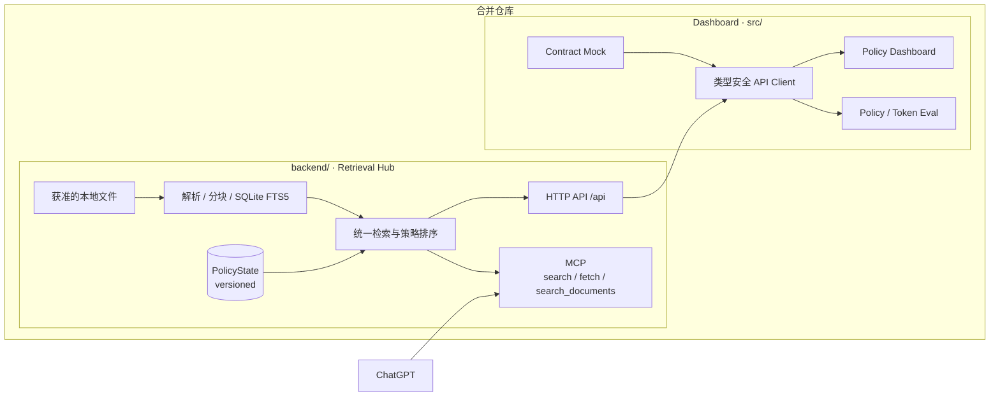
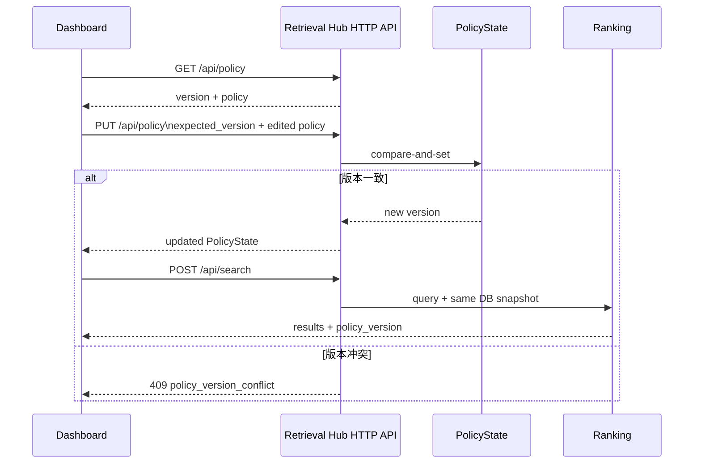

# Retrieval Policy Demo 架构

## 1. 架构结论

本仓库将 Retrieval Hub 与 Dashboard 放在同一代码库中。`backend/` 是文档接入、索引、检索、服务端 ranking、HTTP 与 MCP 的唯一后端；`src/` 通过同一 OpenAPI 契约调用 HTTP 并呈现结果，不实现第二套 ranking。



核心不变量：HTTP、MCP 和 Dashboard 看到的是同一份策略状态和同一套后端排序。

## 2. 组件责任

| 组件 | 责任方 | 本仓库如何使用 |
|---|---|---|
| 数据适配、文档解析、索引 | `backend/` | 读取本机明确配置的文件目录，原始数据不入 Git |
| 检索、ranking 与 Policy 状态 | `backend/` | HTTP 和 MCP 共用实现及数据库状态 |
| HTTP 与 MCP 服务 | `backend/` | HTTP API 提供 Dashboard 能力；MCP 提供只读 search/fetch |
| Dashboard | `src/` | 编辑策略、执行查询、解释服务端结果和冲突 |
| Mock 与契约校验 | 根目录 | 使用 OpenAPI 和 examples 支撑 fixture 开发 |
| 策略/token 评测 | 根目录 | 固定查询、版本、排序、延迟和 payload 指标 |

## 3. 契约边界

机器可读源为 [`contracts/openapi.json`](contracts/openapi.json)，当前 API 版本 `1.2.0`。后端导出副本为 `backend/docs/contracts/`，测试会检查两份契约一致。

本仓库主要依赖：

| Endpoint | 用途 |
|---|---|
| `GET /healthz` | 连通性与 API 版本 |
| `GET /api/status` | 文档、chunk、来源和 policy 版本摘要 |
| `GET /api/retrieval` | 语义索引模型与覆盖率 |
| `GET /api/sync` | 文件同步状态汇总 |
| `GET /api/sync/files` | 分页文件状态与重试信息 |
| `GET /api/sources` | 展示来源及启用状态 |
| `POST /api/search` | 查询、query 级 filter、分项评分和排序 |
| `GET /api/documents/{document_id}` | 结果详情与引用检查 |
| `GET /api/policy` | 获取当前策略及版本 |
| `PUT /api/policy` | 带乐观锁更新共享策略 |

管理类 source/ingest/delete endpoint 由 Hub 管理；当前 Dashboard 页面只读展示数据源和同步状态，通过受限 API 更新检索策略。

## 4. Retrieval Policy 生效链路



上游当前排序语义：

```text
relevance = max(0, -BM25)
freshness = 0.5 ^ (age_days / half_life_days)
score = relevance × source_weight × (1 + recency_boost × freshness)
```

Dashboard 只解释 `score_details`，不能重新执行该公式后改变结果。

## 5. Policy 与 query filter 的区别

- 持久化共享策略：`source_weights`、`recency_boost`、`half_life_days`、`default_limit`。
- 单次查询过滤：`source_ids`、`since`、`until`、`metadata`、`limit`。

因此 metadata filter 当前不是持久化 RetrievalPolicy 的一部分。Dashboard 可以提供单次查询过滤，但如果要求“保存后影响所有后续 MCP 查询”，必须向第一部分提出契约变更，不能只存在浏览器本地状态。

## 6. MCP 映射

| MCP tool | 上游语义 | 本项目验证点 |
|---|---|---|
| `search({query})` | 使用保存策略，返回轻量 `id/title/url` | 排序变化、URL 与 token 大小 |
| `fetch({id})` | 返回完整 `id/title/text/url/metadata` | 引用、正文长度、上下文风险 |
| `search_documents({request})` | 等价于 `POST /api/search` | HTTP/MCP 一致性与高级 filter |

MCP tool 均为只读；策略只能通过受管理权限保护的 HTTP API 修改。

## 7. Token 控制边界

本仓库可以直接控制：

- Dashboard 不把完整文档发送给模型；
- 评测分别记录 search、fetch 和 schema/prompt 的 payload；
- 标准 `search` 结果保持轻量；
- 固定查询避免无效重复调用；
- 对重复 query/result 做实验级缓存，但缓存不能掩盖 policy version 变化。

本仓库当前不能单方面控制：

- `fetch` 返回完整正文且不能静默截断；
- MCP Server 的 tool 描述及传输配置；
- 上游 FTS 分块、召回和 ranking；
- ChatGPT 是否多次 fetch。

若实测完整 `fetch` 超预算，优先形成上游提案，例如增加可引用的 passage item、范围读取或分页工具；在契约变更前不伪造现有 `fetch` 语义。

阶段 D fixture 基线见 [`evaluation/BASELINE.md`](evaluation/BASELINE.md)。当前透明启发式估算显示：

- 标准轻量 `search` 比详细 `search_documents` 样例减少约 72.3% tool-result tokens；
- 额外暴露高级搜索工具增加约 330 个 schema tokens；
- 一次标准 search + 一次 fetch 约 855 tokens，其中短文 fetch 已占约 44.6%。

这些数字用于相对比较，不是模型账单数据；阶段 E 应以真实工具调用与实际 tokenizer 结果替换。

## 8. 环境与安全边界

- 本地上游默认 `127.0.0.1:8765`，读 Token 与管理 Token 分离。
- 浏览器端生产形态不得持有管理 Token，应由 Dashboard 服务端代理。
- loopback URL 无法直接证明 ChatGPT 可访问，阶段 E 需单独验证可达性、认证和引用 URL。
- 文档标题、snippet、正文均视为不可信纯文本。

## 9. 已知架构风险

| 风险 | 影响 | 当前处理 |
|---|---|---|
| `fetch` 完整正文无 token 上限 | 上下文成本不可预测 | 阶段 D/E 测量，必要时提接口变更 |
| 引用 URL 可能是 loopback 或需 Bearer Token | ChatGPT 无法打开引用 | 阶段 E 验证，不在阶段 A 假设成功 |
| FTS 查询要求词项全部出现 | 自然语言 query 可能低召回 | 先用受控短查询评测，记录失败样例 |
| metadata filter 不是持久策略 | 不能自动影响标准 MCP `search` | 明确区分 query filter 与 policy |
| `source_weight` 允许 0–10 | 高权重可能强烈放大相关性 | Dashboard 显示警告并做相关性回归测试 |
| 上游尚无 token telemetry | 难以直接核算模型成本 | 客户端记录 UTF-8 字节与 tokenizer 估算 |
